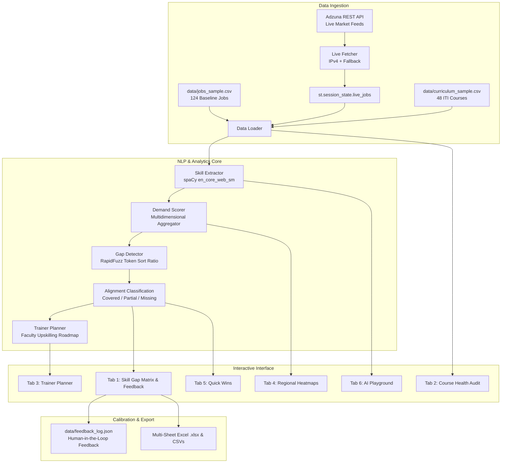

# 🎓 SkillTrack AI — Vocational Skill & Curriculum Alignment Platform

An NLP-powered data intelligence platform that dynamically matches real-time industry job demand against vocational education and ITI curricula across Maharashtra (7 districts, 6 priority industry sectors), surfacing curriculum gaps, auditing course health, and generating faculty development roadmaps.

---

## 📌 Executive Summary

Vocational education programs (ITIs, polytechnics, and skill centers) face a continuous challenge keeping pace with evolving industry demands. **SkillTrack AI** bridges this gap by providing an evidence-based analytics pipeline:
- **Analyzes** real-time market hiring requirements from live job feeds (Adzuna REST API) and localized benchmark postings.
- **Extracts** technical competencies using spaCy natural language processing and token pattern matching.
- **Benchmarks** demanded skills against state vocational curricula using RapidFuzz string similarity algorithms.
- **Categorizes** alignment into three clear tiers: **Covered (≥80%)**, **Partial (50–80%)**, and **Missing (<50%)**.
- **Audits** course health to identify obsolete or oversupplied courses.
- **Generates** actionable faculty upskilling roadmaps mapped to national Sector Skill Councils (SSCs).
- **Incorporates** a continuous human-in-the-loop calibration loop where coordinator and employer feedback refines NLP confidence.

---

## 🗺️ Geographic & Sectoral Scope

- **State**: Maharashtra, India
- **7 Districts**: Pune, Nashik, Nagpur, Mumbai, Aurangabad (Chhatrapati Sambhajinagar), Kolhapur, and Amravati.
- **6 Priority Sectors**:
  1. **Information Technology (IT)**: Cloud Platforms, DevOps, Docker, Kubernetes, NLP, Full-Stack.
  2. **Automotive**: Electric Vehicles (EV), Battery Management Systems (BMS), ADAS Calibration, CAN Bus, CNC.
  3. **Textile**: Digital Sublimation Printing, Sustainable Dyeing, Airjet Looms, CAD Pattern Design.
  4. **Healthcare**: Critical Care / ICU Nursing, Dialysis Tech, Medical Lab Technology (MLT), Infection Control.
  5. **Construction**: Civil Site Engineering, RCC Detailing, BIM/AutoCAD, Safety Compliance (OSHA).
  6. **Retail & E-commerce**: Omnichannel Store Operations, Inventory Forecasting, POS Systems, Visual Merchandising.
- **Framework Standards**: Aligned with Sector Skill Councils under the National Skill Development Corporation (NSDC) and DVET.

---

## 🏛️ System Architecture



---

## 🚀 Technology Stack

| Layer | Technology | Key Details |
|---|---|---|
| **Core Language** | Python 3.12+ | High-performance execution environment |
| **User Interface** | Streamlit | Responsive dashboard with educational theme design system |
| **NLP Engine** | spaCy (`en_core_web_sm`) | Named entity & rule-based technical skill extraction |
| **Matching Algorithm** | RapidFuzz | C++ backend fuzzy string token ratio matching (≥80 threshold) |
| **Data Engine** | Pandas & NumPy | High-speed tabular aggregation, pivoting, and filtering |
| **Heatmap Styling** | Matplotlib & Styler | Gradient heatmap coloring without heavy chart overhead |
| **Live Ingestion** | Requests & urllib3 | REST API client with forced IPv4 socket resolution |
| **Export Generator** | OpenPyXL | Automated 4-sheet formatted Excel workbook export |

---

## 👥 Stakeholders & Use Cases

1. **DVET / State Skill Authorities**: Allocate training infrastructure and sanction new ITI units using district-level gap severity metrics.
2. **ITI Principals & Academic Deans**: Identify and decommission obsolete courses (<40% demand alignment) and introduce emerging modules.
3. **Master Trainers & Vocational Faculty**: Access structured Training-of-Trainers (ToT) roadmaps mapped directly to relevant Sector Skill Councils.
4. **Industry Partners & Employers**: Review curriculum coverage, ingest live job requirements, and calibrate fuzzy matching via "Agree" / "Disagree" feedback.
5. **Students & Trainees**: Ensure training aligns directly with local hiring demand, avoiding outdated qualifications.

---

## 📂 Repository Structure

```
skilltrackhack/
├── app/
│   └── dashboard.py          # Streamlit dashboard (6 tabs, styling, export engines)
├── data/
│   ├── jobs_sample.csv       # Benchmark job postings across 7 districts & 6 sectors
│   ├── curriculum_sample.csv # 48 vocational courses across 6 sectors
│   └── feedback_log.json     # Continuous human-in-the-loop validation audit log
├── src/
│   ├── load_data.py          # Data ingestion and schema validation
│   ├── skill_extractor.py    # Resilient spaCy NLP skill extractor
│   ├── demand_scorer.py      # Multidimensional skill demand aggregator
│   ├── gap_detector.py       # RapidFuzz fuzzy gap detection & trainer flagging
│   └── live_fetcher.py       # Live Adzuna API fetcher with IPv4 resolution & fallbacks
├── tests/
│   ├── test_dashboard_filters.py  # Comprehensive automated filter & styler tests
│   ├── test_live_fetcher_run.py   # Live API regression tests across all 6 sectors
│   └── test_adzuna.py             # Raw Adzuna API credentials test
├── .streamlit/
│   └── config.toml           # Academic light theme configuration (Primary: #1E4D8C)
├── .env                      # API keys (Adzuna credentials)
├── requirements.txt          # Python dependencies
└── README.md                 # Project documentation
```

---

## ⚙️ Installation & Quickstart

### 1. Prerequisites
- Python 3.10 to 3.12
- Git

### 2. Setup Virtual Environment
```bash
# Clone the repository
git clone https://github.com/your-org/skilltrackhack.git
cd skilltrackhack

# Create and activate virtual environment
python -m venv .venv

# Windows PowerShell:
.\.venv\Scripts\Activate.ps1

# Linux / macOS:
source .venv/bin/activate
```

### 3. Install Dependencies
```bash
pip install --upgrade pip
pip install -r requirements.txt
python -m spacy download en_core_web_sm
```

### 4. Configure Environment Variables (Optional for Live API)
Create a `.env` file in the root directory:
```ini
ADZUNA_APP_ID=your_app_id_here
ADZUNA_APP_KEY=your_app_key_here
```
*(Note: If no API keys are provided, the platform automatically utilizes its high-fidelity 6-sector market simulation generator).*

### 5. Run Automated Tests
```bash
# Verify filters, gap detection, and course health calculations
python tests/test_dashboard_filters.py

# Verify live Adzuna API connectivity across all 6 sectors
python tests/test_live_fetcher_run.py
```

### 6. Launch the Dashboard
```bash
streamlit run app/dashboard.py
```
Open **`http://localhost:8501`** in your browser.

---

## 📑 Feature Modules Summary

- **Tab 1 — Skill Gap Matrix**: Interactive cards with fuzzy match confidence, employer demand, and human-in-the-loop validation buttons.
- **Tab 2 — Course Health Audit**: Automated relevance audit for vocational courses (**Aligned ≥70%**, **Needs Update 40–69%**, **Obsolete <40%**).
- **Tab 3 — Trainer Planner**: Actionable faculty upskilling roadmap mapped to National Sector Skill Councils.
- **Tab 4 — Regional View**: District × Sector demand heatmaps and regional gap severity rankings across Maharashtra.
- **Tab 5 — Quick Wins**: Fast-track curriculum improvements focusing on high-demand partial-match skills.
- **Tab 6 — AI Playground**: Real-time spaCy NLP extraction sandbox for ad-hoc job descriptions and syllabus text.
